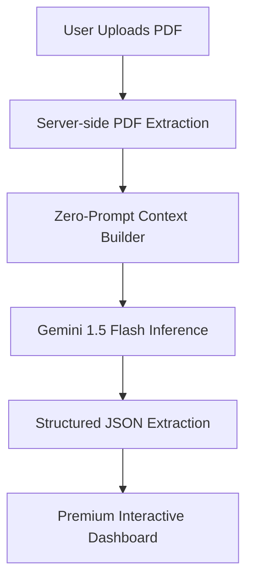

# PromptLess AI — Zero-Prompt Career Assistant

> **PromptWars @ Ascent 2026 | Problem Statement 3: Zero-Prompt AI — AI That Just Works**

[](https://nextjs.org)
[](https://typescriptlang.org)
[](https://tailwindcss.com)
[](https://ai.google.dev)
[](https://vercel.com)

---

## 🎯 The Mission
Traditional AI tools require users to master "Prompt Engineering" — a barrier that excludes millions. **PromptLess AI** is built on the philosophy that **AI should just work.** No prompts, no text boxes, no friction. Just your trajectory and immediate, intelligent results.

## 💡 The Solution
**PromptLess AI** infers user intent through **contextual analysis**. By simply uploading a résumé PDF, the system automatically:
1. **Analyzes** your professional history.
2. **Infers** your target career path.
3. **Generates** a deep-dive dashboard with zero user input.

---

## ✨ Key Features

### 🏢 Executive Dashboard
- **ATS Ranking**: Real-time compatibility score with modern hiring systems.
- **Role Detection**: AI-powered inference of your current trajectory and target seniority.
- **Executive Summary**: A punchy, AI-generated professional pitch.

### 🛠️ Career Deep-Dives (Interactive Modals)
- **ATS Strategy**: Specific keyword gaps and formatting fixes to beat the bots.
- **Interview Prep**: Role-specific Technical & HR questions with contextual hints.
- **LinkedIn Bio**: Ready-to-copy headlines and summaries optimized for visibility.
- **30-Day Roadmap**: A phase-based mastery plan with actionable learning milestones.

---

## 🏗️ How It Works (Zero-Prompt Engine)



1. **Context over Prompts**: Instead of asking the user what they want, we extract their entire professional context from the PDF.
2. **Programmatic Intent**: We use a hidden system architecture to guide Gemini 1.5 Flash into analyzing the resume without user-provided instructions.
3. **Structured Response**: The AI returns a precise JSON schema that powers our high-fidelity React components.

---

## 🛠️ Tech Stack
- **Framework**: Next.js 14 (App Router)
- **AI**: Google Gemini 1.5 Flash (via `@google/generative-ai`)
- **Styling**: Vanilla CSS + Tailwind (Custom Glassmorphism System)
- **Animations**: CSS Keyframes + Smooth Transitions
- **Deployment**: Vercel

---

## 🚀 Setup & Installation

### 1. Requirements
- Node.js 18+
- Gemini API Key ([Get one here](https://aistudio.google.com))

### 2. Installation
```bash
git clone https://github.com/TanveerAbdul/PromptWars-ZeroPrompt-Project.git
cd PromptWars-ZeroPrompt-Project
npm install
```

### 3. Environment Config
Create a `.env.local` file:
```env
GEMINI_API_KEY=your_key_here
```

### 4. Run
```bash
npm run dev
```

---

## 📸 Demo Flow
1. **Landing**: User arrives at a minimal, futuristic hero section.
2. **Upload**: Drag and drop a resume PDF (try the one in the `/examples` folder).
3. **Analysis**: Watch the "Inference Engines" work through 6 distinct analysis phases.
4. **Insights**: Explore the interactive cards, click for deep-dives, and download your final report.

---

## 🏆 PromptWars x Ascent 2026
Built by **Abdul Tanveer J** for the Google PromptWars competition.
**Problem Statement 3**: Zero-Prompt AI — AI That Just Works.
